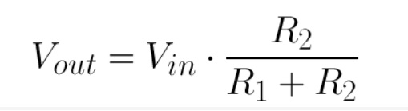
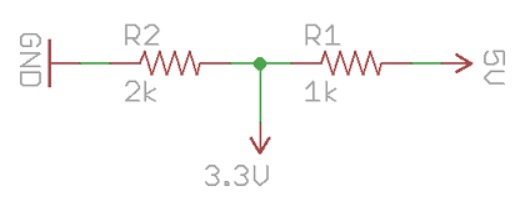
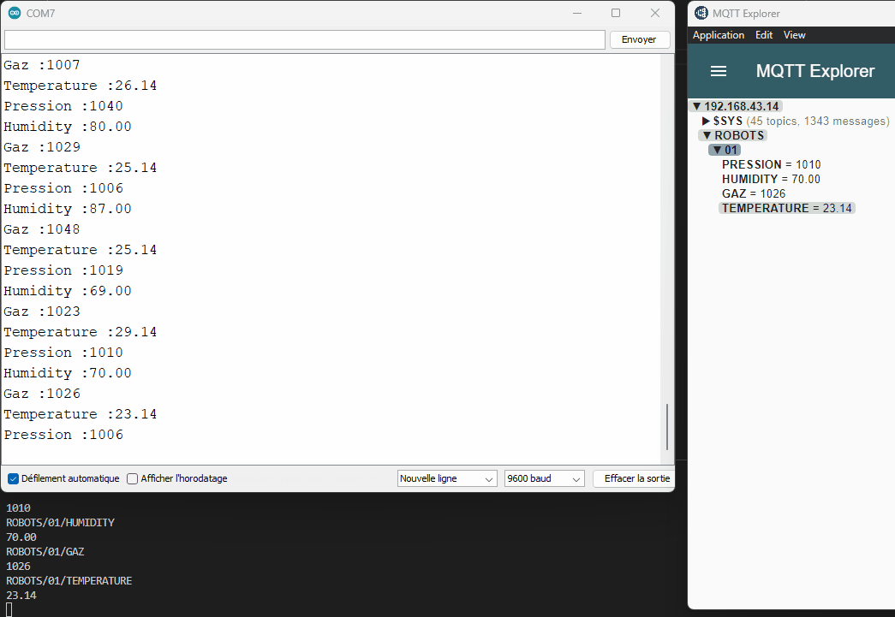
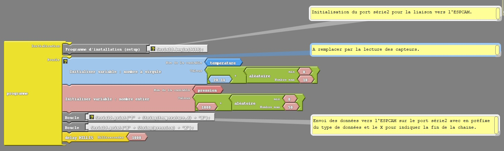

# POC : Mise en oeuvre d'une liaison Série entre une Arduino MEGA et une ESPCAM

## Contexte : 
Pour notre compétition ‘volcano Robot’ le robot ExoMars sera constitué de 12 servomoteurs et différents capteurs, et devra remonter ses mesures par Wifi à un serveur MQTT.

Nous aurons donc une carte Arduino MEGA qui pilotera les servomoteurs et capteurs, puis transmettra les données par liaison série à la carte ESPCAM pour un envoi par WIFI au serveur MQTT.

La carte Arduino MEGA devra être programmable par des collégiens et lycéens sans connaissance d'un langage de programmation, donc par `Block`.

La carte ESPCAM sera pré-programmée par notre équipe.
Une documentation sera remise avec le Kit décrivant le mode et utilisation de cette liaison entre les 2 cartes.

## Objectif :
1. Convertir les signaux de la MEGA sous 5V, en signaux sous 3.3V pour l'ESPCAM
1. Transmettre les données suivantes depuis la carte Arduino MEGA vers la carte ESPCAM puis vers le serveur MQTT
    1. Température en degré Celsius : `FLOAT`
    1. Humidité en pourcentage : `FLOAT`
    1. Pression atmosphérique en Pascal : `ENTIER non signé sur 16 bits`
    1. Gaz en **....** : `Reste à définir`
1. La programmation de la MEGA doit pouvoir se faire par `Block`
1. Réaliser un exemple comme documentation pour la transmission des données

# 1. Conversion des signaux 5V => 3.3V
Deux solutions sont possibles, soit par un pont diviseur, soit par un convertisseur logique.

## Le pont diviseur
Facile à mettre en oeuvre et d'un coût négligeable, il ne permet malheureusement pas une communication à grande vitesse, il conviendra de se limiter aux 9600 Bauds sur une liaison série.

En utilisant 2 résistances et une tension d'entrée, nous pouvons créer une tension de sortie qui est une fraction de celle d'entrée.

<p >
    
</p>

```
Vin  = 5 V
R1   = 1000 Ω
R2   = 1941.18 Ω
Vout = 3.3 V

Je choisis une valeur de résistance existante pour R2 = 2000 Ω = 2 kΩ
```

<p >
    
</p>

## Convertisseur de niveau logique bidirectionnel (Logic Level Converter)
Il réduit également la tension d'un signal. Il s'agit de la méthode recommandée pour niveler les signaux qui nécessitent une communication à grande vitesse (série à un taux de bauds élevé, I2C, etc ... ) et ne coute que quelques €uros.

https://www.gotronic.fr/art-convertisseur-de-4-niveaux-logiques-2595-22272.htm

<p >
    
</p>

## Solution mise en Oeuvre
Pour mes tests, n'ayant pas de LLC sous la main, j'utilise un pont diviseur avec une vitesse de transmission basse de 9600 bauds.

Pour les robots définitifs, nous utiliserons un LLC.

# Liaison Série coté Arduino MEGA
## Programmation
Téléchargement de la dernière version Arduino Augmenté Standard :  https://www.duinoedu.com/arduinoaugmente-default.html

Le programme d'exemple se trouve dans le dossier de ce dépot : `./Arduiblock_Code_Mega`

## Câblage
L'Arduino MEGA comporte 3 ports série :
- Serial sur les broches 0(RX) et 1(TX) (utilisé pour la liaison USB)
- Serial1 sur les broches 19(RX) et 18(TX) 
- Serial2 sur les broches 17(RX) et 16(TX) 

Les 3 ports séries s'initialisent de la même manière dans le `setup()`
```C
Serial.begin(115200); // vers le moniteur Série USB pour debug
Serial2.begin(9600);  // Liaison vers l'ESPCAM 17(RX) // 16(TX)
```

La broche TX sera connectée à l'entrée du pont diviseur afin de convertir les signaux du 5V vers le 3.3V pour l'ESPCAM.

La broche RX sera connectée directement à la broche TX de l'ESPCAM, car il n'y pas besoin de conversion dans ce sens. Le signal à l'état haut sera de 3.3V issu de l'ESPCAM qui sera compris par la MEGA.

## Envoi des Données
### Mise en forme
Il convient de convertir les données sous forme de chaine de caractères.

J'utilise pour cela l'objet  `String()`
- `String(temperature,2)` => conversion du float 'temperature' en chaine de caractères avec 2 chiffres après la virgule,
- `String(pression)` => conversion de l'entier 'pression' en chaine de caractère.

Pour l'envoi, je rajoute un caractère en préfixe définissant la donnée :
- T : Température
- H : Humidité
- P : Pression
- G : Gaz

Et un X en postfixe pour indiquer la fin de la chaine.

**Exemple** : Température à 23.45 °C donne la chaine `"T23.56X"`

### Transmission
Nous avons maintenant une chaine de caractère définissant notre donnée à transmettre, il suffit d'utiliser la fonction `Serial2.print(chaine);`

## Réception des Données
### Les ports séries sur l'ESPCAM
Comme pour l'Arduino MEGA, l'ESPCAM comporte plusieurs ports séries : 
- Serial sur les broches 3(RX) et 1(TX) (utilisés pour la liaison USB)
- Serial1 sans définition de broche
- Serial2 sans définition de broche

Et oui, sur les ESP, il est possible de définir les broches pour les ports séries ou I2C :
```C
// Initialisation liaison Série de debug sur USB    
    Serial.begin(9600);
    Serial.println("\nDémarrage");

// Initialisation liaison avec Arduino MEGA
    Serial2.begin(9600, SERIAL_8N1, 16, 14); // RX , TX
```
J'utilise donc les broches 16 et 14 encore disponibles sur l'ESPCAM.

### Données reçues ?
Lors de la réception, l'algorithme : 
- vérifie si nous sommes sur un entête de message permettant d'identifier le type de donnée et d'initialiser la chaine de caractère
- Puis nous remplissons la chaine avec les caractères reçus
- Enfin lors de la reception du caractère X, nous envoyons la chaine reçue au topic MQTT identifié en 1er lieu

### Renvoi vers serveur MQTT
On reprend les fonctions validées lors du POC_01-ESPCAM sur la connexion au serveur MQTT et la publication des Topics.

### Démonstration en vidéo :
- A gauche sur COM7, le moniteur série sur l'Arduino Mega avec une copie des valeurs envoyées
- En bas sur fond noir, transformation par l'ESPCAM des valeurs reçues en topics  + Envoi vers le serveur MQTT
- A droite, les topics du serveur MQTT MAJ

Des valeurs aléatoires sont transmises par liaison série depuis l'Arduino Mega sur les différents types de données. Les TOPICS du serveur MQTT sont mis à jour en temps réels par l'ESPCAM.

<p >
    
</p>


### Validation des Objectifs :
1. Convertir les signaux de la MEGA sous 5V, en signaux sous 3.3V pour l'ESPCAM
```
Tests validés avec le pont diviseur à une vitesse de 9600 bauds.
Nous utiliserons des Convertisseurs de niveau logique bidirectionnel sur les robots afin de sécuriser les échanges.
```
2. Transmettre les données depuis la carte Arduino MEGA vers la carte ESPCAM puis vers le serveur MQTT
```
Ensemble des tests validés, les données partent de la MEGA et sont publiés sur le serveur MQTT par l'intermédiaire de l'ESPCAM.
```
1. Réaliser un exemple comme documentation pour la transmission des données
<p >
    
</p>

[Robotic974]:      https://www.facebook.com/robotic974
[Nao974]:          https://www.youtube.com/@Nao974Robotic
